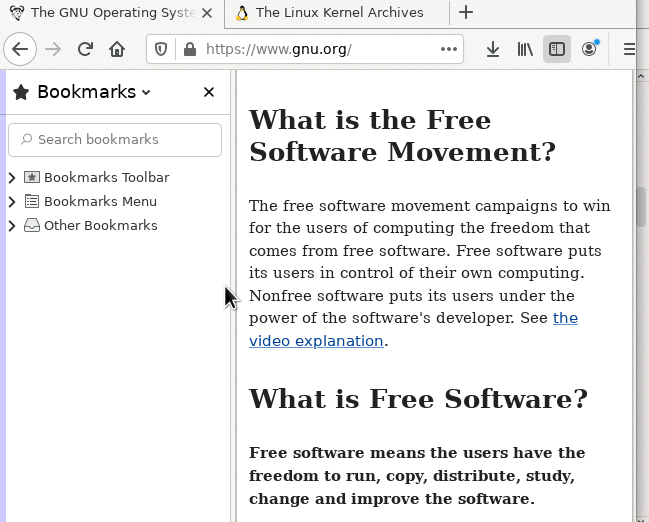

# Sidebar Switch

A switch for Firefox's native sidebar (bookmarks, history, etc). It's a slim vertical button on left of main content. Compatible with vertical tabs.

Replace the legacy addon All in One Sidebar. You can open sidebar by clicking edge of screen.

- Left click: toggle sidebar page (bookmark)
- Right click: toggle sidebar launcher / toggle vertical tabs width
- Middle click: toggle vertical tabs

This is a Firefox userChrome JS script.

Tested on Firefox 140.

---------------------

This repo only contains the specific function, doesn't contain the code to enable userchrome scripts.

**For how to enable, see: (also more of my scripts)**

https://garywill.github.io/#Firefox-userChrome-CSS-or-JS

